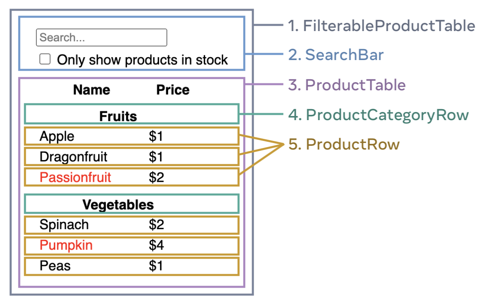

**Thinking in React**


When you want to build an app/dashboard in react, you will realize that are there multiple things you need to code which can get overwhelming fast. 
Therefore, the way to think about the problem in react is to break it into multiple *components*. 

There are 5 simple steps to build UI in react:

*Step 1: Break the UI into a component hierarchy*

Split the design into different pieces. 
-> programming: Use single responsibility principle to make sure that a component does only one thing. 
-> css: consider what you would make class selectors for 
-> design: consider how would organize the design layers



Notice in the image that, the parent component is FilterableProductTable. 

FilterableProductTable -> SearchBar + ProductTable 
ProductTable -> ProductCategoryRow + ProductRow

*Step 2: Build a static version in React 

Adding interactivity requires a lot more thinking and complexity. Therefore, you can build components that reuse other components
and pass data using props. 

Here is an example of building a Table using this approach. 

```
import React, {Fragment, forEach} from "react";


const PRODUCTS = 
[
  { category: "Fruits", price: "$1", stocked: true, name: "Apple" },
  { category: "Fruits", price: "$1", stocked: true, name: "Dragonfruit" },
  { category: "Fruits", price: "$2", stocked: false, name: "Passionfruit" },
  { category: "Vegetables", price: "$2", stocked: true, name: "Spinach" },
  { category: "Vegetables", price: "$4", stocked: false, name: "Pumpkin" },
  { category: "Vegetables", price: "$1", stocked: true, name: "Peas" }
]

function SearchBar () {
  return (
    <form>
      <input type="text" placeholder="Search" />
      <label> 
       <input type="checkbox" />
        Only show items in stock
      </label>
    </form>
    
  ); 
}


function productCategoryRow ({category}) {
  return (
    <tr>
      <th>
        {category}
      </th>
    </tr>

  ); 
}


// Tr tag defines a row in an HTML Table
// Td tag defines a single cell within a table 

function ProductRow ({product}) {
  const name = product.stocked ? product.name: 
  <span style={{color: 'red'}}>
    {product.name}

  </span>; 
  return (
    <tr>
      <td>{name}</td>
      <td>{product.price}</td>
    </tr>

  ); 

}

function ProductTable({ products }) {
  const rows = [];
  let lastCategory = null;

  products.forEach((product) => {
    if (product.category !== lastCategory) {
      rows.push(
        <productCategoryRow
          category={product.category}
          key={product.category} />
      );
    }
    rows.push(
      <ProductRow
        product={product}
        key={product.name} />
    );
    lastCategory = product.category;
  });

  return (
    <table>
      <thead>
        <tr>
          <th>Name</th>
          <th>Price</th>
        </tr>
      </thead>
      <tbody>{rows}</tbody>
    </table>
  );
}


function FilterableProductTable({products}) {
  return (
    <div>
       <SearchBar />
      <ProductTable products={products}/>
    </div>
  ); 
}


export default function App() {
  return <FilterableProductTable products={PRODUCTS} />
}; 


```


